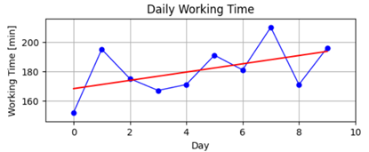

# Generating User Data

# Finding Shortest Path

# Finding Shortest Delivery Route

# Monte Carlo Optimization

# Real Data Simulation for 2 Days

# Results & Interpretations
## Simulation 1 (100 Nodes, 100 Customers, 10 Warehouses and 30 Days)

## Simulation 2 (100 Nodes, 100 Customers, 20 Warehouses and 30 Days)

## Simulation 3 (100 Nodes, 150 Customers, 20 Warehouses and 30 Days)

